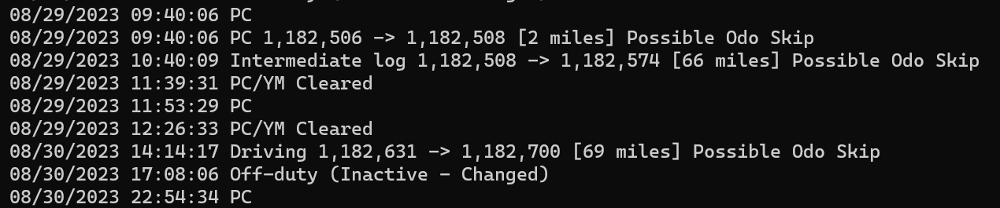

ERODS Core is a light weight data parser that works with ELD files to read and preview key events found
within event data, getting you through the logbook inspection with nothing left unturned. 

### Process
    - Transfer driver ELD data to FMCSA
    - Open ELD data using ERODS
    - Click [File] -> [Output Event List to CSV]
    - Save file to "erods" folder within ERODS Core directory
    - Run ERODS Core application and select your saved CSV

### What Happens
eCore will cycle through all events in the csv file and return each event that meets the following
criteria:\

    - Any Personal Conveyance event, including PC/YM End
    - Any driving instance preceded by non-driving instances where an odometer skip is present
    - Any inactive/changed events triggered from log book edit annotations
    - Any Unidentified driving events

### Data
The data includes the date and timestamp of each event that can be referenced on ERODS. Odometer skip events
will also include the amount of miles calculated between a non-driving event and an initial following driving
event. Any inactive statuses will be displayed for each of the four categories.

Once a file is run you can save a text file to the eCore directory for easy printing.
CSV files stored can be erased at any time from the home operations screen.

